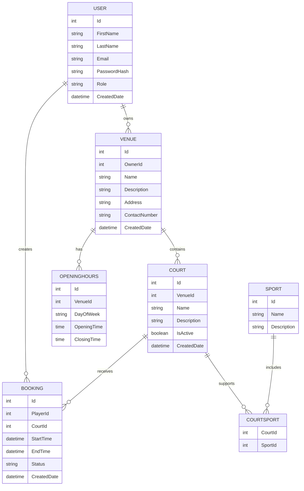

# Database Design

## Overview

The database is designed to support a multi-tenant sports court booking platform.

The system allows:

* Players to register and book courts.
* Venue owners to register venues and manage courts.
* Administrators to manage platform activity.
* The platform to support multiple racket sports such as badminton and pickleball, with the ability to expand to additional sports in the future.

The initial database will use Microsoft SQL Server with Entity Framework Core as the Object-Relational Mapper (ORM).

---

# Entities

# User

## Description

Stores all users who interact with the platform.

Users can have different roles:

* Player
* Venue Owner
* Administrator

A single user account is used for authentication and authorization.

---

## Columns

| Column       | Description                    |
| ------------ | ------------------------------ |
| Id           | Unique identifier for the user |
| FirstName    | User's first name              |
| LastName     | User's last name               |
| Email        | User's login email address     |
| PasswordHash | Securely stored password hash  |
| PhoneNumber  | Optional contact number        |
| Role         | Determines user permissions    |
| CreatedDate  | Date the account was created   |

---

## Relationships

* A User can own multiple Venues.
* A User can create multiple Bookings.

Example:

```
User
 |
 | owns
 |
Many Venues
```

```
User
 |
 | creates
 |
Many Bookings
```

---

# Venue

## Description

Represents a sports facility that offers courts for players to book.

A venue belongs to a venue owner who manages the facility.

Examples:

* Badminton centre
* Pickleball club
* Sports complex

---

## Columns

| Column        | Description                            |
| ------------- | -------------------------------------- |
| Id            | Unique identifier for the venue        |
| OwnerId       | References the User who owns the venue |
| Name          | Name of the venue                      |
| Description   | Information about the venue            |
| Address       | Physical location of the venue         |
| ContactNumber | Venue contact information              |
| CreatedDate   | Date the venue was registered          |

---

## Relationships

* A Venue belongs to one User (owner).
* A Venue contains many Courts.

Example:

```
User

1
|
|
Many

Venue
```

```
Venue

1
|
|
Many

Court
```

---

# Court

## Description

Represents an individual playable court inside a venue.

A court can support one or more sports.

Examples:

```
Court 1:
- Badminton
- Pickleball

Court 2:
- Badminton
```

---

## Columns

| Column      | Description                                |
| ----------- | ------------------------------------------ |
| Id          | Unique identifier for the court            |
| VenueId     | References the venue it belongs to         |
| Name        | Court name or number                       |
| Description | Additional information about the court     |
| IsActive    | Determines whether the court can be booked |
| CreatedDate | Date the court was created                 |

---

## Relationships

* A Court belongs to one Venue.
* A Court can support multiple Sports.
* A Court can have many Bookings.

Example:

```
Venue

1
|
|
Many

Court
```

---

# Sport

## Description

Stores supported sports available on the platform.

This allows the application to expand beyond badminton and pickleball.

Examples:

* Badminton
* Pickleball
* Tennis
* Squash

---

## Columns

| Column      | Description                            |
| ----------- | -------------------------------------- |
| Id          | Unique identifier                      |
| Name        | Sport name                             |
| Description | Additional information about the sport |

---

## Relationships

* A Sport can be supported by many Courts.
* A Court can support many Sports.

This creates a many-to-many relationship.

The relationship is managed using:

```
CourtSport
```

---

# CourtSport

## Description

Join table connecting courts and sports.

This table is required because a court can support multiple sports, and a sport can exist across multiple courts.

---

## Columns

| Column  | Description        |
| ------- | ------------------ |
| CourtId | References a Court |
| SportId | References a Sport |

---

## Relationships

Many-to-many relationship:

```
Court

Many
 |
 |
CourtSport
 |
 |
Many

Sport
```

---

# Booking

## Description

Represents a reservation made by a player for a specific court.

A booking records when and where a player wants to play.

---

## Columns

| Column      | Description                            |
| ----------- | -------------------------------------- |
| Id          | Unique identifier for the booking      |
| PlayerId    | References the User making the booking |
| CourtId     | References the booked court            |
| StartTime   | Booking start date and time            |
| EndTime     | Booking end date and time              |
| Status      | Current booking status                 |
| CreatedDate | Date the booking was created           |

---

## Possible Status Values

Example values:

```
Pending
Confirmed
Cancelled
Completed
```

---

## Relationships

* A Booking belongs to one Player.
* A Booking belongs to one Court.

Example:

```
User

1
|
|
Many

Booking

Many
|
|
1

Court
```

---

# OpeningHours

## Description

Stores when a venue is available for bookings.

Instead of creating every possible booking slot, the system calculates availability based on:

* Venue opening hours
* Existing bookings
* Court availability

---

## Columns

| Column      | Description                     |
| ----------- | ------------------------------- |
| Id          | Unique identifier               |
| VenueId     | References the venue            |
| DayOfWeek   | Day the availability applies to |
| OpeningTime | Venue opening time              |
| ClosingTime | Venue closing time              |

---

## Relationships

* A Venue can have multiple OpeningHours records.

Example:

```
Venue

Monday:
9:00 AM - 10:00 PM

Tuesday:
9:00 AM - 10:00 PM
```

---

# Database Relationship Summary

```
User
 |
 | 1-to-many
 |
Venue
 |
 | 1-to-many
 |
Court
 |
 | many-to-many
 |
Sport
```

```
User
 |
 | 1-to-many
 |
Booking
 |
 | many-to-1
 |
Court
```

```
Venue
 |
 | 1-to-many
 |
OpeningHours
```

---

# Entity Relationship Diagram (ERD)

The following diagram represents the relationships between the main database entities.


# Future Considerations

Potential future database additions:

* Payments
* Reviews and ratings
* Court pricing
* Promotions and discounts
* Recurring bookings
* Tournament management
* Multiple venue locations
* Membership subscriptions
* Booking cancellation policies
