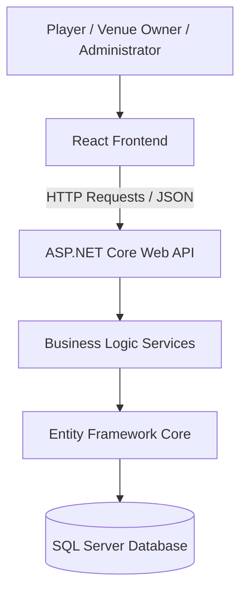
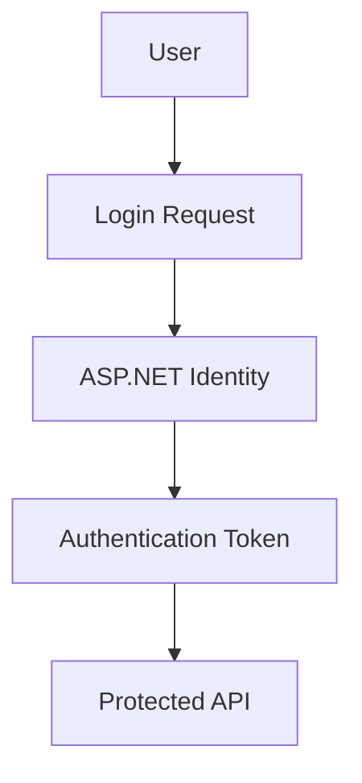

# System Architecture

## Overview

The Court Booking Platform follows a client-server architecture consisting of:

- A React frontend responsible for user interaction.
- An ASP.NET Core Web API backend responsible for business logic and data processing.
- A SQL Server database responsible for persistent data storage.

The frontend communicates with the backend through HTTP requests using REST API endpoints.

---

# High-Level Architecture



---

# Frontend Architecture

## Technology

The frontend will use:

- React
- Vite
- JavaScript or TypeScript
- CSS framework (to be decided)

---

## Responsibilities

The frontend is responsible for:

- Displaying pages and components.
- Handling user interaction.
- Managing client-side state.
- Sending requests to the backend API.
- Displaying booking availability.
- Showing validation messages.

---

## Example Frontend Structure

```
frontend/

src/

├── components/
├── pages/
├── services/
├── hooks/
├── context/
└── App.jsx
```

---

## Frontend Communication

The frontend communicates with the backend through REST API calls.

Example:

```
React Component

        |
        |
        ↓

API Service

        |
        |
        ↓

ASP.NET Core API Endpoint
```

Example request:

```
GET /api/venues
```

Response:

```json
[
    {
        "id": 1,
        "name": "Example Sports Centre"
    }
]
```

---

# Backend Architecture

## Technology

The backend will use:

- ASP.NET Core Web API
- Entity Framework Core
- SQL Server

---

## Responsibilities

The backend is responsible for:

- Processing API requests.
- Validating incoming data.
- Implementing booking rules.
- Handling authentication and authorization.
- Communicating with the database.
- Returning responses to the frontend.

---

# Backend Layer Structure

The backend follows a layered architecture.

```
ASP.NET Core API

        |
        |
Controllers

        |
        |
Services

        |
        |
Repositories / Data Access

        |
        |
Entity Framework Core

        |
        |
SQL Server
```

---

## Controllers

Controllers handle HTTP requests from the frontend.

Examples:

```
AuthController

VenueController

CourtController

BookingController
```

Responsibilities:

- Receive requests.
- Validate request data.
- Call appropriate services.
- Return HTTP responses.

---

## Services

Services contain the application's business logic.

Examples:

```
BookingService

VenueService

UserService
```

Responsibilities:

- Check court availability.
- Prevent overlapping bookings.
- Manage venue rules.
- Process application logic.

---

## Entity Framework Core

Entity Framework Core acts as the bridge between the application and SQL Server.

Responsibilities:

- Map C# classes to database tables.
- Execute database queries.
- Manage migrations.

Example:

```
Booking class

        ↓

Booking table
```

---

# Authentication and Authorization

## Authentication

Users will authenticate using ASP.NET Core Identity.

Authentication flow:



---

## Authorization

The system uses role-based authorization.

User roles:

```
Player

Venue Owner

Administrator
```

Example permissions:

| Role | Permissions |
|---|---|
| Player | Search venues, create bookings, manage own bookings |
| Venue Owner | Manage venues, courts, availability |
| Administrator | Manage users and platform data |

---

# Booking Data Flow

Example booking process:

```
Player

↓

Select Venue

↓

Select Court

↓

Choose Date and Time

↓

React sends booking request

↓

ASP.NET Core validates availability

↓

Booking saved using EF Core

↓

SQL Server updated

↓

Confirmation returned to React
```

---

# Deployment Architecture (Future)

The initial development environment will be local.

Future deployment may include:

```
Users

↓

Hosted React Application

↓

Cloud Hosted ASP.NET Core API

↓

Cloud SQL Server Database
```

Potential hosting options:

- Microsoft Azure
- AWS
- Other cloud providers

Deployment decisions will be made later.

---

# Future Architecture Considerations

Potential future improvements:

- Real-time booking updates using SignalR.
- Payment processing integration.
- Email/SMS notifications.
- Mobile application support.
- Caching for improved performance.
- Logging and monitoring.